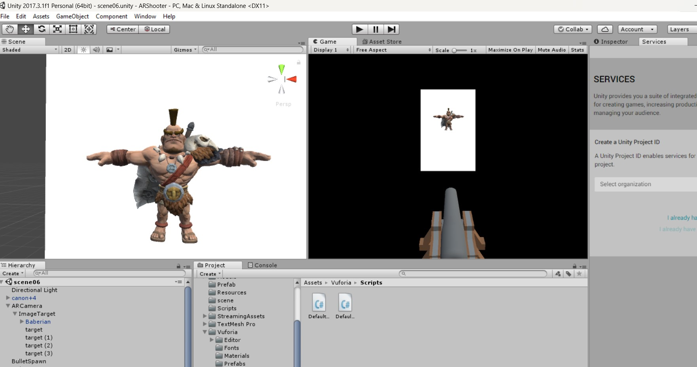
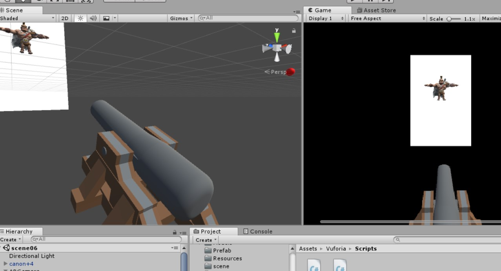

# 🎮 About

**AR Shooter** is a prototype mobile app designed as a fun learning project to explore **augmented reality (AR)** development. This basic AR game, inspired by *Pokemon GO*, aims to make shopping more exciting! Players can find hidden objects in supermarket posters and earn 🎉 discounts offered on specific days.  
This app was built for educational purposes to learn AR development. It includes a working prototype of the game, and many advanced features are ideas proposed for future versions.  

---

## 🎯 Objectives
-   Develop a game-based AR solution to make shopping more interesting.
-   Implement a system to attract and retain customers while boosting supermarket profitability.
-   Introduce users to modern technological tools like augmented reality.

---

## 🛠️ Technologies Used  
- 📱 **Augmented Reality (AR)**  
- 🤖 **Android**  
- 🧩 **Vuforia SDK**  
- 🎮 **Unity Game Engine**  

---

## 📸 Screenshots

---

## ⚠️ Disclaimer  
This application was developed as an educational project and is intended for learning and demonstration purposes.
